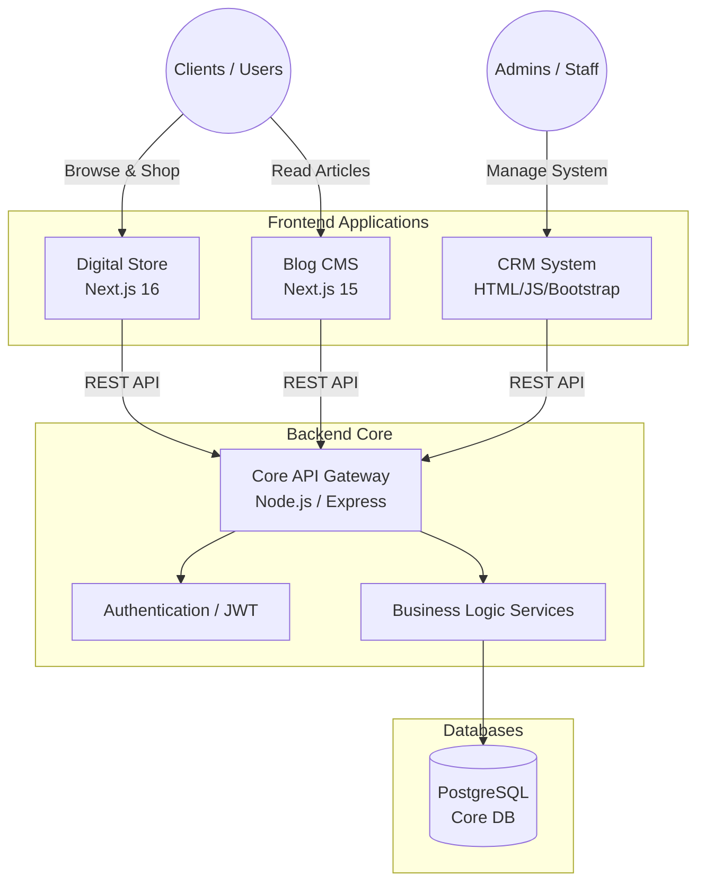

<div align="center">
  

  <p>
    <a href="https://nextjs.org/"></a>
    <a href="https://nodejs.org/"></a>
    <a href="https://expressjs.com/"></a>
    <a href="https://www.prisma.io/"></a>
    <a href="https://www.postgresql.org/"></a>
    <a href="https://www.docker.com/"></a>
  </p>
  
  <p>
    <i>A comprehensive, scalable, and modern E-Commerce and CRM ecosystem built with a microservices-oriented monorepo architecture.</i>
  </p>
</div>

---

## 📖 Overview

This repository houses a complete **E-Commerce & CRM Ecosystem**. Designed with a **Service-Oriented Architecture (SOA)**, the system is highly scalable and maintainable, making it suitable for enterprise-level deployments. It orchestrates multiple independent applications handling different business domains—from customer-facing digital storefronts and SEO-optimized blogs to internal administration and powerful core APIs.

## 🏗 System Architecture

The project is structured as a **Monorepo**, leveraging modern tooling to share configurations and packages across multiple applications. 



## 📂 Ecosystem Structure

All applications reside within the `apps/` directory, while shared resources and configurations are managed in `packages/`.

### 1. [Backend Core (`apps/backend-core`)](./apps/backend-core)
- **Role:** The heart of the ecosystem. It handles complex business logic, database transactions, robust authentication, role-based access control (RBAC), and serves a RESTful API.
- **Tech Stack:** Node.js, Express, Prisma ORM, PostgreSQL, JWT, Multer.

### 2. [Digital Store (`apps/digital-store`)](./apps/digital-store)
- **Role:** The customer-facing digital storefront. Optimized for Core Web Vitals, SEO, and seamless user experience for purchasing digital products.
- **Tech Stack:** Next.js 16, React 19, Tailwind CSS, Zustand.

### 3. [CRM System (`apps/crm-system`)](./apps/crm-system)
- **Role:** The internal administration portal. Features advanced dashboards, order tracking, product management, and revenue analytics.
- **Tech Stack:** React 19, Vite, Tailwind CSS, React Query, Lucide Icons.

### 4. [Blog & CMS (`apps/blog-cms`)](./apps/blog-cms)
- **Role:** A content management system designed to drive organic traffic and boost inbound marketing.
- **Tech Stack:** Next.js 15, PostgreSQL, Prisma, Tailwind CSS.

---

## ✨ Key Features

- **Robust Backend Core:** RESTful APIs built with Node.js & Express, utilizing Prisma ORM for type-safe database interactions with PostgreSQL.
- **Advanced Authentication:** Secure JWT-based auth system with Role-Based Access Control (RBAC) separating Customers and Admins.
- **Modern E-Commerce Storefront:** Next.js-powered digital store with global state management via Zustand, optimized for Core Web Vitals and seamless checkout experiences.
- **Powerful CRM Dashboard:** React/Vite-based admin panel leveraging React Query for efficient data fetching, caching, and mutations.
- **Integrated Blog CMS:** Next.js 15 Server Components for blazingly fast, SEO-friendly content delivery.
- **Containerized Ecosystem:** Docker Compose configuration orchestrating the entire stack for unified development and production deployments.

---

## 🚀 Getting Started (Docker Compose)

The entire ecosystem is fully containerized. You can spin up the development environment with a single command.

### Prerequisites
- [Docker](https://www.docker.com/products/docker-desktop) and Docker Compose installed.
- Node.js v18+ (for local development outside of Docker).

### Installation

1. **Clone the repository:**
   ```bash
   git clone https://github.com/dangtienvn/e-cormmerce-platform.git
   cd e-cormmerce-platform
   ```

2. **Environment Setup:**
   Duplicate the `.env.example` files in each application to `.env` and fill in the necessary database credentials.
   
3. **Spin up the Ecosystem:**
   Use the provided Docker Compose configuration to start all services, databases, and networks:
   ```bash
   docker-compose up -d --build
   ```

4. **Access the Applications:**
   - Digital Store: `http://localhost:3000`
   - Blog CMS: `http://localhost:3002`
   - CRM System: `http://localhost:8080`
   - Backend API: `http://localhost:5000`

---

## 👨‍💻 Author & Contact

This project is actively developed and maintained as a demonstration of software engineering best practices, monorepo architecture, and modern web development.

- **Author:** Đặng Thanh Tiến (Thanh Tien Dang)
- **Email:** td2812009@gmail.com
- **Phone:** 0363226094
- **LinkedIn:** [Thanh Tien Dang](https://www.linkedin.com/in/thanh-tien-dang/)

---
<div align="center">
  <i>Built with passion and commitment to clean, scalable code.</i>
</div>
